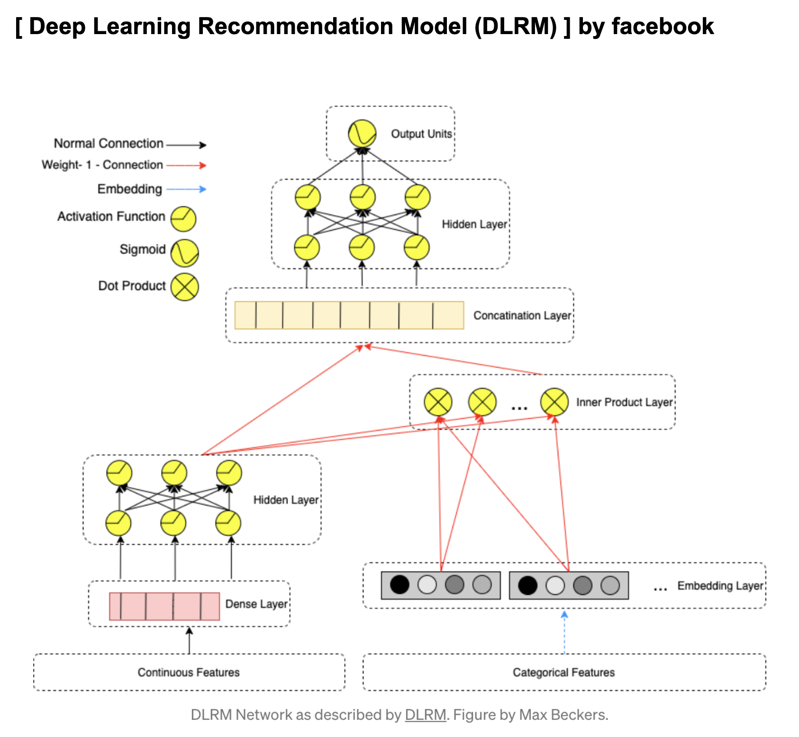

# DLRM model with tensorflow
------------------

#### Deep Learning Recommendation Model from facebook research

- Deep Learning Recommendation Model for Personalization and Recommendation Systems https://arxiv.org/abs/1906.00091 

------------------ 
#### Model Architecture




#### Datasets 
- Adult datasets : https://www.kaggle.com/wenruliu/adult-income-dataset 


#### Task 
- Predict the income over 50k 


------------------ 
#### requirements 

```
pip install -r requirements.txt
```

